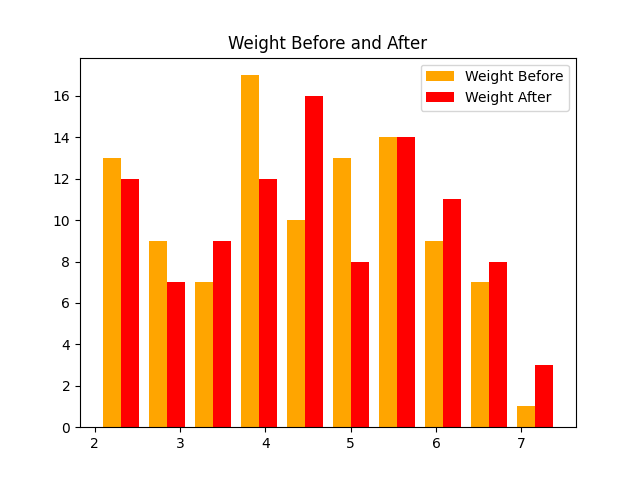
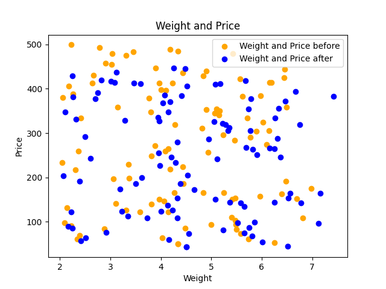
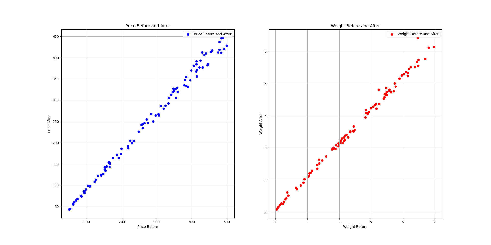

# 📦 Product Data Analysis – Price & Weight Changes

## 📌 Overview
This project analyzes a dataset of 100 products to study *price* and *weight changes* over time.  
By comparing *before* and *after* values, we identify trends, calculate differences, and uncover patterns in product pricing and packaging.

---

## 📂 Dataset
*File:* product_100_rows.csv

*Columns:*
- Product – Name of the product
- Category – Product category (e.g., Electronics, Grocery)
- Price Before – Price before change
- Price After – Price after change
- Weight Before – Weight before change
- Weight After – Weight after change
- Date – Date of observation/change

---

## 🔍 Steps Performed
1. *Data Loading & Inspection*
   - Read CSV file into Pandas DataFrame
   - Checked for missing values and duplicates

2. *Price Analysis*
   - Calculated absolute and percentage change in price
   - Identified products with price increases/decreases  

   📊 **Visualization**:  
   

3. *Weight Analysis*
   - Calculated change in weight
   - Flagged cases of *shrinkflation* (less weight, same/higher price)  

   📊 **Visualization**:  
   

4. *Category-wise Trends*
   - Grouped products by category
   - Found average change in price and weight per category  

   📊 **Visualization**:  
   

5. *Date-based Trends*
   - Checked how changes varied over different dates  

   📊 **Visualization**:  
   

---
